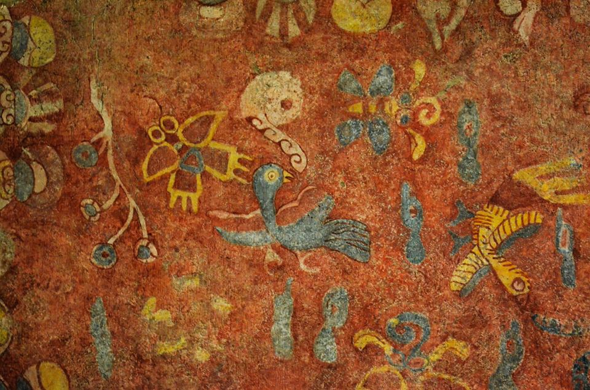

# About

Soy bióloga y mono! Trabajo fósiles de aves del Pleistoceno y busco sus patrones en la variación del tamaño corporal, que con suerte algún día y con ayuda de la estadística podré decir algo sobre los procesos que dieron lugar a esa variación. 
Tengo especial interés en las aves de México. Y también en restos de aves arqueológicas. [Link al libro Aqueofauna Teopancazco](http://www.iia.unam.mx/directorio/archivos/MANL510125/2017_Manzanilla-Valadez_UsoRecurNatTeopancazco.pdf)
También me gusta mucho la pintura mural prehispánica, aquella que tiene aves! [Saber más de PMP](http://www.pinturamural.esteticas.unam.mx/serie_pintura_mural)

